<!-- AUTOMATICALLY GENERATED BY CYBERPUNK GITHUB PROFILE DASHBOARD GENERATOR -->
<!-- DO NOT EDIT MANUALLY - EDIT src/config.py AND REGENERATE -->

<picture>
  <source media="(prefers-color-scheme: dark)" srcset="assets/dark.svg">
  <source media="(prefers-color-scheme: light)" srcset="assets/light.svg">
  
</picture>

<!-- SECTION 1: PROFILE OVERVIEW -->

<h1 style="color: #00F0FF; margin-bottom: 2px;">⚡ YUG PATEL</h1>
<h3 style="color: #FF007F; margin-top: 0;">Data & ML Engineer</h3>

  Data & ML Engineer focused on designing high-throughput data pipelines, real-time streaming engines, and autonomous AI systems. Driven by clean code and system resilience.

  
  &nbsp;
  
  &nbsp;
  

  
  &nbsp;&nbsp;
  

<!-- SECTION 2: TECH STACK & CURRENT LEARNING -->

<h2 style="color: #00F0FF; margin-bottom: 12px;">🛠️ CORE TECHNOLOGIES & LIBRARIES</h2>

   &nbsp;  &nbsp;  &nbsp;  &nbsp;  &nbsp;  &nbsp;  &nbsp;  &nbsp;  &nbsp;  &nbsp;  &nbsp;  &nbsp;  &nbsp;  &nbsp;  &nbsp;  &nbsp; 

<h3 style="color: #00F0FF; margin-bottom: 10px;">🧠 CURRENTLY LEARNING</h3>

<ul style="list-style-type: none; padding-left: 0; margin-top: 0; font-size: 13px; line-height: 1.6;">
  <li style='margin-bottom: 6px;'><code style='color:#00F0FF;'>▸</code> Cloud Computing Architecture</li><li style='margin-bottom: 6px;'><code style='color:#00F0FF;'>▸</code> Advanced Data Engineering & Event Streaming</li><li style='margin-bottom: 6px;'><code style='color:#00F0FF;'>▸</code> Machine Learning Systems</li><li style='margin-bottom: 6px;'><code style='color:#00F0FF;'>▸</code> LLMs & Agentic DAG Orchestration</li><li style='margin-bottom: 6px;'><code style='color:#00F0FF;'>▸</code> Distributed System Design</li>
</ul>

<!-- SECTION 3: FEATURED PROJECTS -->

<h2 style="color: #00F0FF; margin-bottom: 12px;">💻 FEATURED PROJECTS</h2>

  <table width="100%">
  <tr>
    <td><h3 style="color: #00F0FF; margin: 0; font-size: 16px;">🚀 Griot AI Platform</h3></td>
    <td align="right">
      
    </td>
  </tr>
  </table>
  

    Autonomous DAG orchestration platform with self-healing Llama 3 execution engine and security layer.
  

  

    
    &nbsp;
    
    &nbsp;
    
    &nbsp;
    
    &nbsp;
    
  

  

    
    &nbsp;&nbsp;
    
  

  <b style="color: #FF007F; font-size: 13px;">⚡ MORE PROJECTS CURRENTLY BUILDING…</b>

<!-- SECTION 4: CERTIFICATIONS & CONTACT -->

<h2 style="color: #00F0FF; margin-bottom: 12px;">📜 CERTIFICATIONS & 🌐 CONNECT</h2>

<ul style="list-style-type: none; padding-left: 0; margin-top: 0; font-size: 13px; line-height: 1.8;">
  <li>📜 <b style="color: #FF007F;">Certifications:</b> Currently preparing for official AWS & Data Engineering certifications.</li>
  <li>🐙 <b style="color: #FF007F;">GitHub:</b> <a href="https://github.com/yp2505" style="color: #00F0FF;">github.com/yp2505</a></li>
  <li>💼 <b style="color: #FF007F;">LinkedIn:</b> <a href="https://linkedin.com/in/yug-patel" style="color: #00F0FF;">linkedin.com/in/yug-patel</a></li>
  <li>📧 <b style="color: #FF007F;">Email:</b> <a href="mailto:yugpatel@example.com" style="color: #00F0FF;">yugpatel@example.com</a></li>
</ul>
